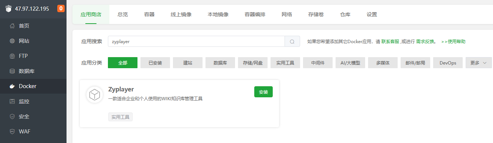

<p align="center">
    
</p>

<h1 align="center">zyplayer-doc</h1>

<p align="center">专注于私有化部署的在线知识库管理平台</p>

# 项目简介
zyplayer-doc是一款适合团队和个人私有化部署使用的WIKI文档管理工具，同时还包含数据库管理、Api接口管理等模块。

适合作为公司内部或个人的知识库、笔记、文档管理工具，将文档发布成对外可访问的形式，可作为公司的产品文档、帮助文档等。

体验地址：[http://zyplayer.com](http://zyplayer.com)

在线文档：[http://doc.zyplayer.com](http://doc.zyplayer.com)

欢迎有想法的同学一起来完善，如果觉得不错就给个Star鼓励下呗！作为给项目快速更新的动力！

欢迎加入微信群与我们一起交流
> 微信群员超过限制只能加好友拉进群，添加微信好友，回复：`加群` 即可


# 快速启动
## 相关依赖
启动本系统仅依赖JAVA和MySQL
- JAVA 1.8+
- MySQL 5.7.x、8.x

数据库安装成功后，需要您**手动创建**一个库：`zyplayer_doc`

```sql
-- 建库语句
create database zyplayer_doc;
```

> 建表SQL脚本无需手动执行，每次启动或更新之后都会检查当前版本，然后自动执行升级SQL脚本，所以每次有版本更新需求只需要下载最新版本启动即可，无需其他特殊操作

## 宝塔面板一键部署
- 安装宝塔面板，前往[宝塔面板](https://www.bt.cn/u/2OCdV3)官网，选择对应的脚本下载安装，宝塔版本：`9.2.0+`
- 登录宝塔面板，在菜单栏中点击 Docker，根据提示安装 Docker 和 Docker Compose 服务，若已有则跳过
- 在Docker-应用商店查询到 zyplayer-doc，点击安装
- 设置域名等基本信息，点击确定
- 提交后面板会自动进行应用初始化，大概需要1-5分钟，初始化完成后即可访问。


## Main方法启动
1. 修改`zyplayer-doc-manage/src/main/resources/application.yml`配置文件里面的数据库账号密码
2. 执行`org.dromara.zyplayer.manage.Application.main`方法启动项目

## JAR方式启动
1. 直接下载：直接下载编译好的jar打包文件，编译后的最新版可到 [发行版下载处](https://gitee.com/dromara/zyplayer-doc/releases) 去下载
2. 自行编译：也可以自己动手编译，双击执行：`zyplayer-doc\build.bat`，将使用maven编译整个项目为可执行的jar文件，编译结果文件放在：`zyplayer-doc\dist\version`文件夹下
3. 修改第一步或第二步结果文件夹下的`application.yml`文件里面数据库帐号密码
4. 双击第一步或第二步结果文件夹下的`startup.bat`启动项目

## Tomcat容器启动
1. 直接下载编译好的war打包文件，编译后的最新版可到 [发行版下载处](https://gitee.com/dromara/zyplayer-doc/releases) 去下载
2. 修改配置文件：`zyplayer-doc.zip\apache-tomcat\webapps\zyplayer-doc\WEB-INF\classes\application.yml`配置文件里面的数据库账号密码
3. 双击`tomcat\bin\startup.bat`启动即可

## 其他
更多启动方式请参考文档：[项目下载与部署](http://doc.zyplayer.com/#/integrate/zyplayer-doc/opensource/279)

启动后访问：[http://127.0.0.1:8083](http://127.0.0.1:8083) ，默认登录账号： **zyplayer**  密码： **123456**

# 用爱发电
如果您正在使用这个项目并感觉良好，或者是想支持项目继续开发，您可以通过如下`任意`方式支持我们：
1. Star并分享 [zyplayer-doc](https://gitee.com/zyplayer/zyplayer-doc)
2. 保留`关于页面`的项目链接
3. 你也可以选择使用 [商业版](https://doc.zyplayer.com/#/integrate/zyplayer-doc/commercial) 来支持我们

# 界面展示
控制台页面


WIKI文档页面

